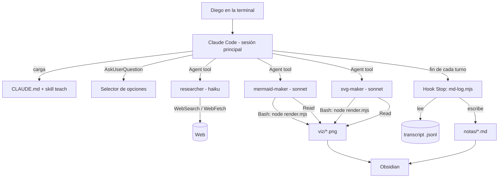

# AI Teacher — Diseño

> Fase 2 de SDD. Define **cómo** se cumple cada requisito de `requirements.md`.

## 1. Mapeo: original (pi) → recreación (Claude Code)

| Pieza original | Qué hacía | Reemplazo en Claude Code | Requisitos |
|---|---|---|---|
| `skills/teach/SKILL.md` | Filosofía + proceso | `.claude/skills/teach/SKILL.md` (traducida y adaptada a Diego) | RF-01…09, 13 |
| `skills/visualize/SKILL.md` | Cuándo y cómo delegar diagramas | `.claude/skills/visualize/SKILL.md` | RF-23, 24, 26 |
| `extensions/ask-user-question.ts` (669 líneas) | Popups de preguntas | Herramienta **nativa** `AskUserQuestion`. Cero código. | RF-05, 14 |
| `extensions/quiz.ts` (1062 líneas) | Quiz calificado con UI | `AskUserQuestion` + **protocolo de quiz** en la skill + archivo de clave (`quiz-key`) | RF-10…13 |
| `extensions/md-log.ts` (443 líneas) | Espejo de la sesión a `.md` | **Hook `Stop`** + script Node que lee el transcript + skills `/md-log` y `/md-unlog` | RF-15…18 |
| `extensions/visual-tools/` | Herramientas de render para makers | Script Node `render.mjs` invocado vía `Bash` + `Read` para mirar el PNG | RF-25 |
| `agents/researcher.md` (GLM vía OpenRouter + `web_search` de terceros) | Verificación web | Subagente con `WebSearch`/`WebFetch` **nativos** y `model: haiku` | RF-19…22 |
| `agents/mermaid-maker.md`, `svg-maker.md` | Diagramas verificados | Subagentes con `model: sonnet`, herramientas `Read, Write, Bash` | RF-24, 25 |
| `pi-interactive-subagents` + tmux | Correr subagentes | Subagentes **nativos** de Claude Code. Sin tmux → Windows nativo. | RC-02 |
| `/login` de pi (cobraba extra) | Autenticación | `claude` con login de suscripción Pro | RC-01, 03 |

Resultado: de ~3 100 líneas de TypeScript quedan **dos scripts Node pequeños** (md-log y render). Todo lo demás es markdown.

## 2. Arquitectura



## 3. Estructura de carpetas

```
ai-teacher/                      ← vault de Obsidian y raíz del proyecto
├── CLAUDE.md                    ← contexto permanente: perfil, idioma, reglas
├── README.md                    ← instalación y solución de problemas
├── MANUAL.md                    ← guía de uso diario
├── package.json                 ← dependencias de los scripts
├── .claude/
│   ├── settings.json            ← modelo por defecto, hooks, permisos, flags
│   ├── skills/
│   │   ├── teach/SKILL.md
│   │   ├── visualize/SKILL.md
│   │   ├── md-log/SKILL.md      ← /md-log <ruta>
│   │   └── md-unlog/SKILL.md    ← /md-unlog
│   ├── agents/
│   │   ├── researcher.md
│   │   ├── mermaid-maker.md
│   │   └── svg-maker.md
│   └── scripts/
│       ├── md-log.mjs           ← hook Stop + comandos link/unlink
│       └── render.mjs           ← mermaid|svg → PNG
├── .learn/                      ← estado interno (en .gitignore)
│   ├── state.json               ← { "pending": null, "links": { "<session_id>": "notas/tcp.md" } }
│   └── quiz-key.jsonl           ← claves de quiz comprometidas
├── notas/                       ← clases en markdown
│   └── _cuaderno.md             ← índice de estudio: temas, progreso, próximo paso (RNF-06)
├── viz/                         ← PNG publicados
└── specs/ai-teacher/            ← estos documentos SDD
```

## 4. Componentes

### 4.1 `CLAUDE.md`

Se carga en cada sesión. Contiene:
- Perfil de Diego (RF-09) y idioma español (RC-04).
- Regla: "Cada vez que expliques o enseñes algo, usa la skill `teach`".
- Flags de ahorro leídos de aquí (ver 4.8).

### 4.2 Skill `teach`

Traducción fiel de la original con estos cambios:
- Tercera persona "él" → "Diego".
- Nombres de herramientas: `quiz` → "protocolo de quiz (sección X)", `ask_user_question` → `AskUserQuestion`, `subagent(...)` → "subagente `researcher` vía la herramienta Agent".
- Se conserva íntegra la sección **"Writing quiz options — construction procedure"** (RF-13).
- Nueva sección **Protocolo de quiz** (4.3).
- Nueva sección **Modo ahorro** (4.8).

### 4.3 Protocolo de quiz (RF-10…13, RNF-05)

`AskUserQuestion` no califica: solo muestra opciones y devuelve la elegida. La calificación se hace con un protocolo de **compromiso previo**:

1. **Comprometer:** antes de preguntar, el tutor ejecuta:
   `node .claude/scripts/md-log.mjs quiz-commit --id <qid> --correct "<etiqueta exacta>" --explanation "<texto>"`
   Esto agrega una línea a `.learn/quiz-key.jsonl`. El tutor no muestra la respuesta en su texto.
2. **Preguntar:** `AskUserQuestion` con hasta 3 opciones reales + **"No sé"**. El orden de la opción correcta varía entre preguntas.
3. **Calificar:** tras la respuesta, el tutor ejecuta:
   `node .claude/scripts/md-log.mjs quiz-grade --id <qid> --answer "<etiqueta elegida>"`
   El script compara contra la clave y devuelve `✓` / `✗` / `NO_SE` + correcta + explicación. El tutor transmite ese resultado **tal cual**.

Así la respuesta queda fijada antes de responder (RF-12) y la calificación es determinística. Spike S1 confirmó: máximo 4 opciones por pregunta → formato **3 reales + "No sé"**. `AskUserQuestion` agrega siempre "Other" (texto libre): cualquier respuesta que no sea la correcta ni "No sé" se califica `✗`.

### 4.4 `AskUserQuestion` para preguntas abiertas (RF-05, RF-14)

Uso directo, sin protocolo. La skill prohíbe usarlo para cosas con respuesta correcta.

### 4.5 md-log (RF-15…18)

**`/md-log <ruta>`** (skill con `disable-model-invocation: true`): indica a Claude ejecutar `node .claude/scripts/md-log.mjs link "<ruta>" --session "${CLAUDE_SESSION_ID}"`, que escribe `links[session_id] = ruta` en `.learn/state.json`. El siguiente `render` regenera el bloque de esa sesión. Así el vínculo es **por sesión**: abrir una sesión nueva no reescribe la nota de otra.

**`/md-unlog`**: ejecuta `... unlink --session "${CLAUDE_SESSION_ID}"`, que borra `links[session_id]` directamente. El siguiente `render` ya no escribe (su bloque previo queda intacto en la nota).

**Corrección de fiabilidad (ADR-08):** cuando `${CLAUDE_SESSION_ID}` se expande a un id real, `link`/`unlink` escriben `links[session_id]` de forma directa, sin pasar por `pending`, para evitar que dos sesiones concurrentes se pisen el mismo campo compartido. `pending` (ahora `{ path, at }`) solo se usa como *fallback* cuando el id llega vacío o sin expandir (empieza con `$` o contiene `{`), y el siguiente `render` lo aplica a `links[session_id]`. Todo `pending` con más de 10 minutos de antigüedad se descarta en `render` para no vincular la nota equivocada a una sesión que arrancó mucho después.

**Varias sesiones en una misma nota.** Continuar un tema otro día = vincular la misma ruta en la sesión nueva. Cada sesión escribe solo su propio bloque, delimitado por marcadores HTML (invisibles en Obsidian):
```
<!-- md-log:session <session_id> start -->
...contenido regenerado de esa sesión...
<!-- md-log:session <session_id> end -->
```
`render` reemplaza el bloque de su sesión si existe o lo agrega al final si no. Todo lo que esté fuera de los marcadores (frontmatter, notas manuales) se conserva.

**Hook `Stop`** en `settings.json`:
```json
{
  "hooks": {
    "Stop": [
      { "hooks": [{ "type": "command",
        "command": "node \"$CLAUDE_PROJECT_DIR/.claude/scripts/md-log.mjs\" render" }] }
    ]
  }
}
```

**`md-log.mjs render`**:
1. Lee JSON por stdin → obtiene `transcript_path` y `session_id`.
2. Aplica `pending` (vincular o desvincular) a `links[session_id]`. Si la sesión no tiene vínculo, sale con código 0.
3. Recorre el `.jsonl` completo y **regenera el bloque de su sesión** (idempotente: evita duplicados y da backfill gratis).
4. Incluye: mensajes de usuario (sin los generados por skills/comandos), texto del asistente, bloques `AskUserQuestion` como `> **Pregunta:** … / **Opciones:** … / **Respuesta:** …`.
5. Excluye: tool calls de Bash/Read/Write/Agent, resultados de herramientas, y las líneas `quiz-commit` (RNF-05).
6. Escritura atómica (archivo temporal + rename) para que Obsidian no lea un archivo a medias.

Limitación aceptada: el `.md` se actualiza al terminar cada turno, no en vivo. La pregunta del quiz se ve en la terminal mientras tanto.

### 4.6 Subagente `researcher` (RF-19…22)

```yaml
---
name: researcher
description: Use this agent to verify any fact, name, date, formula or definition before teaching it, and to map a topic before planning. Returns a sourced brief.
tools: WebSearch, WebFetch
model: haiku
---
```
Cuerpo: el prompt original (facetas, ángulos de búsqueda, evaluación de fuentes, formato Summary/Findings/Sources/Gaps), traducido. Haiku para gastar menos cupo.

### 4.7 Makers + `render.mjs` (RF-23…26)

**`render.mjs`**:
```
node .claude/scripts/render.mjs mermaid <in.mmd> [--save <slug>]
node .claude/scripts/render.mjs svg <in.svg> [--save <slug>]
```
- Mermaid → PNG con `@mermaid-js/mermaid-cli` (trae su propio Chromium vía Puppeteer; funciona en Windows).
- SVG → PNG con `@resvg/resvg-js` (binarios precompilados para Windows; reemplaza a `rsvg-convert`, que no existe nativo en Windows).
- Sin `--save`: escribe `.learn/preview.png` e imprime la ruta.
- Con `--save`: copia a `viz/viz-<slug>-<timestamp>.png` e imprime `filename:` y `path:`.

**Makers** (`tools: Read, Write, Edit, Bash`, `model: sonnet`): mismo ciclo que el original — escribir fuente en `.learn/`, renderizar preview, **leer el PNG con `Read`** (Claude Code muestra imágenes al modelo), criticar, iterar, publicar, devolver bloque `RESULT:`.

Permisos en `settings.json`: permitir sin preguntar `Bash(node .claude/scripts/render.mjs:*)` y `Bash(node .claude/scripts/md-log.mjs:*)`.

### 4.8 Modo ahorro (RF-27, RC-05)

En `CLAUDE.md`:
```
## Configuración del tutor
- researcher: on        # on | off | solo-plan
- visuales: on          # on | off
```
- `off`: el tutor no invoca ese subagente. Con researcher en `off`, marca con ⚠️ lo que enseñe sin verificar.
- `solo-plan`: el researcher se usa una vez en Plan (RF-20), no en cada duda.

Modelo por defecto de la sesión: `sonnet` en `.claude/settings.json`.

### 4.9 Cuaderno de estudio (RNF-06)

Problema: al abrir `claude` otro día, Diego no debe tener que recordar qué estudió ni dónde quedó.

**`notas/_cuaderno.md`** — índice legible en Obsidian, una sección por tema:
```markdown
## TCP
- Nota: [[tcp]] · Objetivo: entender por qué TCP garantiza orden
- Estado: en curso · Última sesión: 2026-09-25
- [x] Paquetes y pérdida
- [ ] Números de secuencia   ← próximo
- [ ] Ventana deslizante
```

**Quién lo escribe:** el tutor (skill `teach`), con `Edit`, en tres momentos fijos: (1) al aprobarse el Plan crea la sección con los nodos del mapa como checklist; (2) al pasar la verificación de un nodo lo marca `[x]` y mueve `← próximo`; (3) al cerrar o pausar la clase actualiza "Estado" y "Última sesión". Si `_cuaderno.md` no existe, lo crea.

**Cómo llega al tutor:** hook **`SessionStart`** → `node .claude/scripts/md-log.mjs notebook`, que imprime un resumen compacto (temas en curso + nodo próximo de cada uno) o `Cuaderno vacío`. La salida de `SessionStart` entra al contexto, así el tutor puede abrir con "La última vez quedamos en TCP → números de secuencia. ¿Seguimos?".

**Retomar un tema:** el tutor sugiere `/md-log notas/<tema>.md` con la misma nota y salta Probe/Plan (ya aprobados), haciendo solo un quiz corto de repaso del último nodo completado antes de seguir.

## 5. Decisiones (ADR resumidas)

| # | Decisión | Alternativas descartadas | Motivo |
|---|---|---|---|
| ADR-01 | Claude Code en vez de pi | pi + extra usage; pi + OpenRouter | RC-01: pi cobra aparte. Claude Code usa el cupo Pro. |
| ADR-02 | Windows nativo | WSL2 | Sin tmux ya no hace falta Linux. Obsidian lee la carpeta directo. Requiere Git for Windows (Claude Code ejecuta hooks con Git Bash). |
| ADR-03 | Quiz = AskUserQuestion + compromiso en archivo | Servidor MCP propio con UI; quiz en texto plano | MCP no puede dibujar UI interactiva en la terminal; texto plano pierde el selector. El compromiso da calificación honesta con muy poco código. |
| ADR-04 | md-log regenera todo en hook `Stop` | Append incremental; hook `PreToolUse` en AskUserQuestion | Regenerar es idempotente y da backfill. Los hooks `PreToolUse` sobre `AskUserQuestion` tienen un bug conocido que vacía la respuesta. |
| ADR-05 | Scripts en Node, no C# | .NET console app | `mermaid-cli` ya exige Node; `dotnet run` arranca lento para un hook de cada turno. |
| ADR-06 | researcher en Haiku | Sonnet | Búsqueda + resumen no necesita el modelo más caro; ahorra cupo. |
| ADR-07 | `resvg-js` para SVG | `rsvg-convert`, ImageMagick | Sin instalaciones de sistema en Windows. |
| ADR-08 | md-log vinculado por sesión, con bloques delimitados | Un `logFile` global | Con uno global, una sesión nueva sobrescribiría la nota de otra clase al regenerar. |
| ADR-09 | Cuaderno escrito por el tutor + leído por hook `SessionStart` | Script que infiere progreso del transcript | El progreso (nodo aprobado) es semántico: lo sabe el tutor, no un parser. El hook garantiza que se lea sin depender de la memoria del modelo. |
| ADR-10 | `.puppeteerrc.cjs` con `skipDownload: true` + navegador (Chrome/Edge) ya instalado en Windows | Dejar que Puppeteer descargue su propio Chromium | Ese Chromium pesa ~200 MB y `npm install` ya es la única llamada de red permitida (RNF-04) — no tiene sentido duplicarla. `render.mjs` resuelve una lista ordenada de candidatos (`PUPPETEER_EXECUTABLE_PATH` → Chrome → Edge) y prueba cada uno hasta que uno lanza con éxito, pasándolo a `puppeteerConfig.executablePath`. Chrome se prueba antes que Edge porque, en esta máquina, el lanzador `(x86)` de Edge se detecta pero no llega a abrir el puerto de DevTools bajo Puppeteer, mientras que Chrome sí lanza de forma confiable. |

## 6. Riesgos

| Riesgo | Mitigación |
|---|---|
| Se agota el cupo de 5 h a mitad de clase | Modo ahorro; Probe con preguntas agrupadas (hasta 4 por llamada a AskUserQuestion). |
| Formato del transcript `.jsonl` cambia entre versiones | Spike S2 documenta el formato; el parser ignora tipos desconocidos en vez de fallar. |
| El tutor olvida el protocolo de quiz | Regla en la skill + criterio de aceptación en T3; si reincide, mover las instrucciones críticas a `CLAUDE.md`. |
| `ANTHROPIC_API_KEY` definida en Windows → Claude Code cobra por API | Verificación en T0 y en README. |
| Puppeteer no descarga Chromium (proxy/antivirus) | `render.mjs` acepta `PUPPETEER_EXECUTABLE_PATH` apuntando a Chrome/Edge instalado. |
